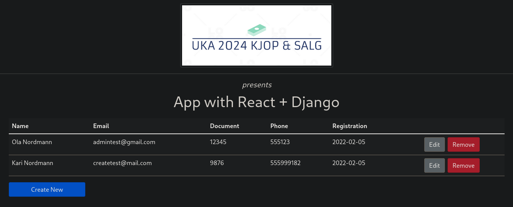

# django_react_prototype
Largely based on [this tutorial](https://blog.logrocket.com/creating-an-app-with-react-and-django/)

## Setup
Commands presume you're at the root of the repo.

### Prerequisites:
- python
- pip
- node
- npm
- MySQL

### Setup virtual environment:  
`python -m venv .venv`

### Install necessary packages:
Backend packages:  
`pip install django djangorestframework django-cors-headers`

Frontend packages:  
>Note: try to use react-bootstrap bootstrap@5.1.3 instead of reactstrap in the real project  

`cd students-fe`  
`npm install bootstrap reactstrap axios --save`  

### Creating a local database:  
`MySql`  
`CREATE DATABASE testdb`  

## How to run
Start backend:  
`cd ..`  
`python manage.py runserver`  

Start frontend:  
`cd students-fe`  
`npm start`  
